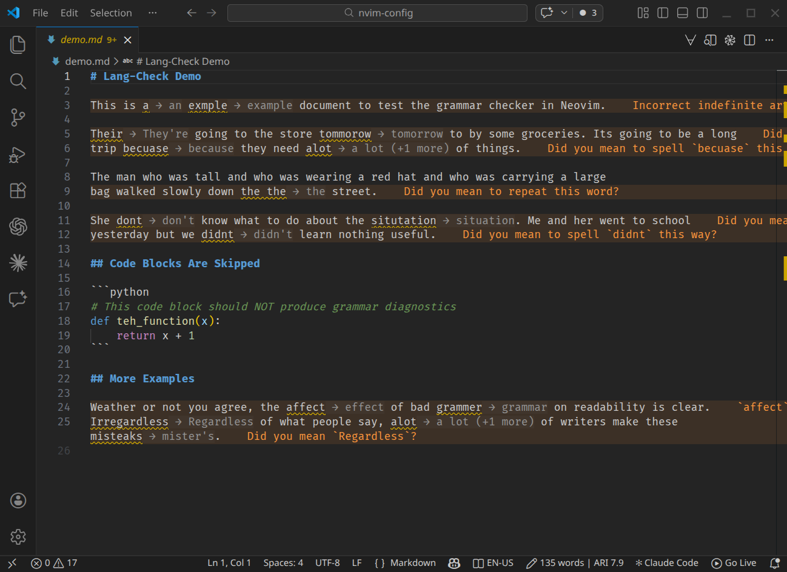
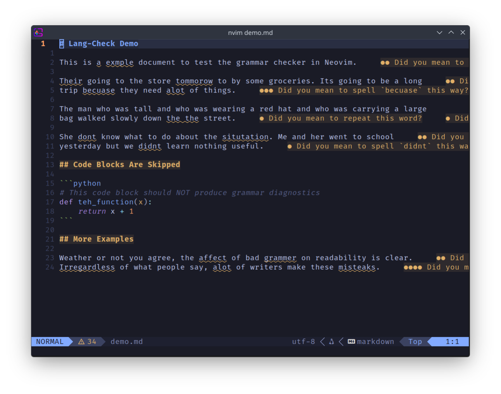

<p align="center">
  <picture>
    <source media="(prefers-color-scheme: dark)" srcset="assets/titlecard-dark.png" />
    <source media="(prefers-color-scheme: light)" srcset="assets/titlecard-light.png" />
    
  </picture>
</p>

<p align="center">
  <a href="https://github.com/KaiErikNiermann/LangCheck/releases"></a>
  <a href="https://github.com/KaiErikNiermann/LangCheck/actions/workflows/release.yml"></a>
  <a href="https://marketplace.visualstudio.com/items?itemName=KaiErikNiermann.language-check"></a>
  <a href="https://crates.io/crates/lang-check"></a>
</p>

A fast, extensible grammar and style checker for Markdown, HTML, LaTeX, Typst, and more. Ships as a VS Code extension and Neovim plugin, backed by a Rust core binary with LSP and Protobuf server modes.

> [!NOTE]
> Language Check is in **early development**. Core checking works and is usable day-to-day, but expect rough edges — if you hit a bug, please [open an issue](https://github.com/KaiErikNiermann/LangCheck/issues) and it will be addressed promptly. The configuration format may evolve between minor versions; backwards compatibility is a goal but not yet guaranteed.

<table>
<tr>
<td width="47%"><strong>VS Code</strong></td>
<td width="50%"><strong>Neovim</strong></td>
</tr>
<tr>
<td></td>
<td></td>
</tr>
</table>

## Features

- **Multi-engine checking** — local Harper engine for instant feedback, optional LanguageTool for deep grammar analysis, optional [Vale](https://vale.sh/) for style linting with its rich plugin ecosystem, external binaries, and WASM plugins via Extism
- **Tree-sitter parsing** — extracts prose from Markdown, HTML, LaTeX, Typst, and more while skipping code blocks, math, and markup
- **SpeedFix panel** — keyboard-driven batch review: press `1`–`9` for suggestions, `a` to add to dictionary, `i` to ignore, `Space` to skip
- **Inline suggestions** — inlay hints, ghost text completions, and quickfix code actions
- **Standalone CLI** — `language-check check`, `fix`, `list-rules`, and `config` subcommands
- **Workspace indexing** — background indexing with redb-backed caching
- **Rule normalization** — unified rule IDs across providers for consistent severity overrides
- **Prose insights** — word count, sentence count, and Automated Readability Index in the status bar
- **Inspector** — debug webview showing AST structure, prose extraction ranges, and check latency
- **i18n** — extension UI localized in English, German, French, and Spanish

## Quick Start

### VS Code Extension

1. Install the extension from the VS Code marketplace (publisher: `KaiErikNiermann`)
2. Open a Markdown, HTML, LaTeX, or Typst file — checking starts automatically on save
3. Press `Alt+F` to open the SpeedFix panel

### Neovim

```lua
-- lazy.nvim
{
  "KaiErikNiermann/lang-check.nvim",
  ft = { "markdown", "html", "latex", "typst", "restructuredtext",
         "org", "bibtex", "sweave" },
  opts = {},
}

-- Or with Neovim 0.11+ native LSP config:
vim.lsp.enable("lang_check")
```

See [editors/nvim/README.md](editors/nvim/README.md) for full setup instructions.

### CLI

```sh
# Build from source
cd rust-core
cargo build --release

# Check a file
./target/release/language-check check README.md

# Auto-fix high-confidence issues
./target/release/language-check fix docs/

# List available rules
./target/release/language-check list-rules
```

## Project Structure

```
lang-check/
├── rust-core/          Rust core binary (server + CLI)
│   ├── src/
│   │   ├── engines.rs      Harper, LanguageTool, External, WASM engines
│   │   ├── orchestrator.rs  Multi-engine coordinator
│   │   ├── prose.rs         Tree-sitter prose extraction
│   │   ├── rules.rs         Rule normalization
│   │   ├── config.rs        YAML/JSON configuration loader
│   │   ├── workspace.rs     redb-backed workspace indexing
│   │   └── ...
│   └── bin/
│       ├── language-check-server.rs   LSP + Protobuf stdio server
│       └── language-check.rs          Standalone CLI
├── editors/nvim/       Neovim plugin (lang-check.nvim)
│   ├── lua/lang_check/   Plugin core (config, binary, health)
│   ├── lsp/              Neovim 0.11+ native LSP config
│   └── doc/              Vim help file
├── extension/          VS Code extension (TypeScript)
│   ├── src/
│   │   ├── extension.ts    Activation, commands, providers
│   │   ├── client.ts       Protobuf IPC client
│   │   ├── api.ts          Public API for other extensions
│   │   ├── downloader.ts   Core binary auto-download
│   │   └── trace.ts        Protobuf message tracing
│   ├── webview/            SpeedFix + Inspector UIs (Svelte 5 + Tailwind)
│   ├── l10n/               Runtime localization bundles
│   └── package.nls.*.json  Command/setting translations
├── proto/              Protobuf schema (checker.proto)
├── docs/               Sphinx documentation
├── scripts/            Build utilities
└── docker-compose.yml  Local LanguageTool server
```

## Configuration

Create a `.languagecheck.yaml` in your workspace root:

```yaml
engines:
  harper: true
  languagetool: true
  languagetool_url: "http://localhost:8010"
  external:
    - name: vale
      command: /usr/bin/vale
      args: ["--output", "JSON"]
      extensions: [md, rst]
  wasm_plugins:
    - name: custom-checker
      path: .languagecheck/plugins/checker.wasm

rules:
  spelling.typo:
    severity: warning
  grammar.article:
    severity: off

performance:
  high_performance_mode: false
  debounce_ms: 300
  max_file_size: 1048576

auto_fix:
  - find: "teh"
    replace: "the"
```

See `language-check config init` to generate a default configuration.

## Development

### Prerequisites

- Rust 2024 edition (1.85+)
- Node.js 18+ and pnpm
- Protobuf compiler (`protoc`)

### Building

```sh
# Rust core
cd rust-core
cargo build

# Extension
cd extension
pnpm install
pnpm run proto:gen
pnpm build
```

### Testing

```sh
# Rust — unit tests + snapshot tests (insta)
cd rust-core
cargo test

# Extension — vitest
cd extension
pnpm test
```

### Linting

```sh
# Rust
cargo clippy -- -D warnings
cargo fmt --check

# TypeScript
cd extension
pnpm lint
```

### Local LanguageTool

```sh
docker compose up -d
# LanguageTool API available at http://localhost:8010
```

### Git Hooks

The project uses [Lefthook](https://github.com/evilmartians/lefthook) for pre-push checks (cargo check, clippy, fmt, test, and tsc).

## Plugin System

Language Check supports three extension mechanisms:

| Type | Sandboxed | Config key | Protocol |
|------|-----------|------------|----------|
| External binary | No | `engines.external` | JSON over stdin/stdout |
| WASM plugin | Yes (Extism) | `engines.wasm_plugins` | `check(input) -> output` export |
| VS Code API | N/A | — | `LanguageCheckAPI` interface |

See `docs/advanced/plugins.md` for the WASM plugin development guide.

## Documentation

Full documentation is built with Sphinx:

```sh
cd docs
pip install -r requirements.txt
make html
# Open _build/html/index.html
```

## License

[MIT](LICENSE)
